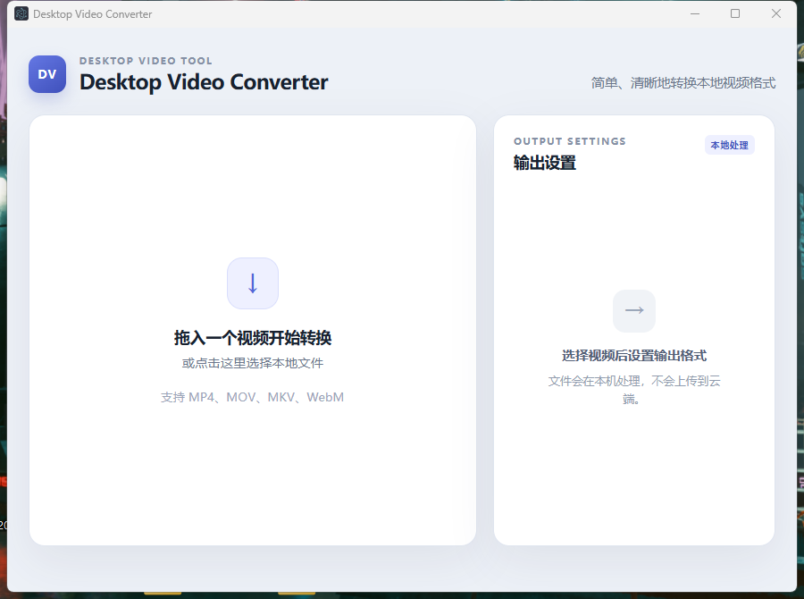
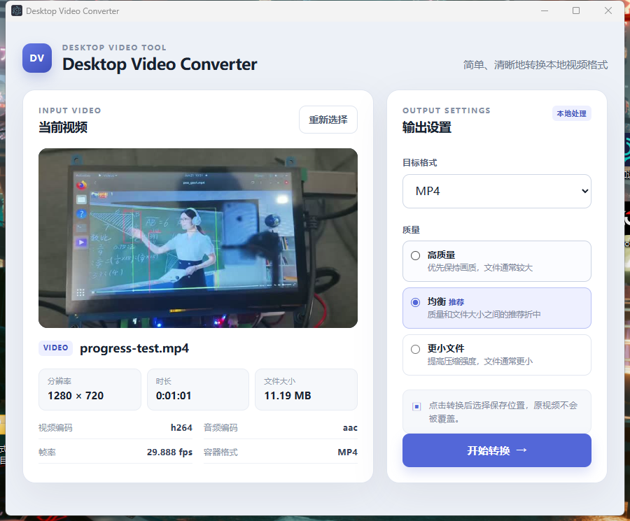
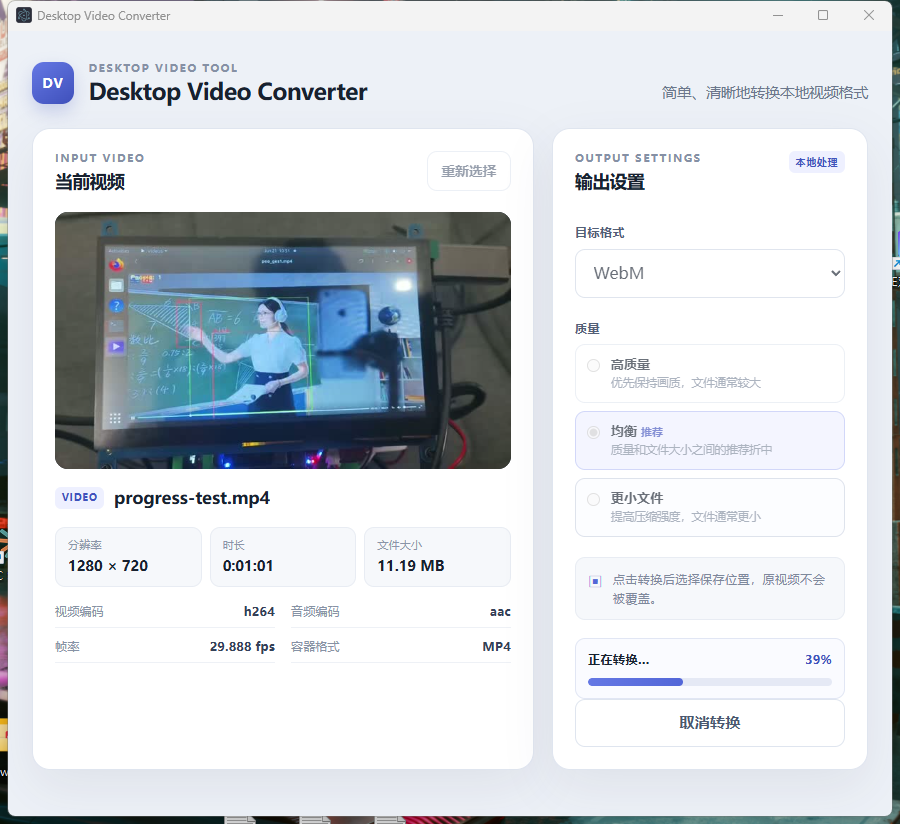
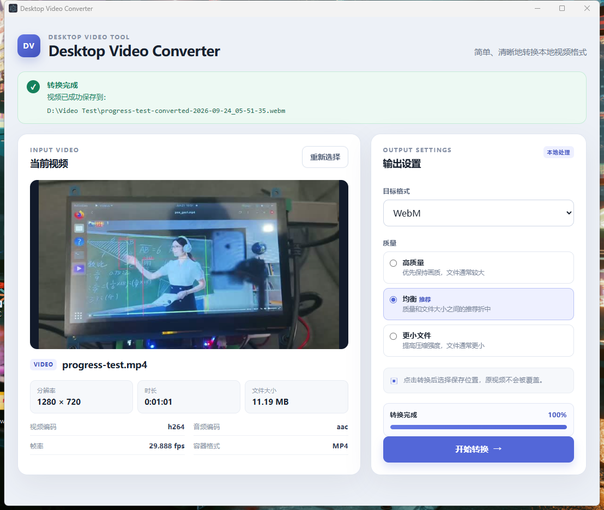
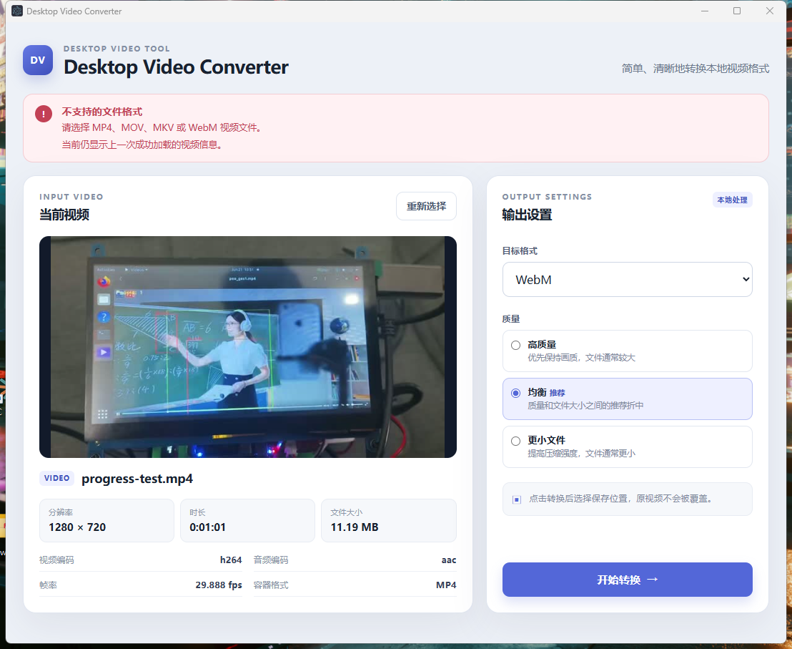

# Desktop Video Converter

这是一个基于 Electron、React、TypeScript 和 FFmpeg 的 Windows 桌面视频格式转换器，面向需要简单本地视频处理流程的普通桌面用户。

当前支持：

- 本地视频选择与 Drag & Drop 导入；
- 视频 metadata 展示和缩略图生成；
- MP4、MOV、MKV、WebM 转换；
- High、Balanced、Smaller 三档质量预设；
- 实时转换进度和主动取消；
- 时间戳输出文件名；
- staged output、安全提交和输出冲突保护；
- 输入文件失效、文件夹拖入、输出路径不可用等友好错误提示。

## 界面预览

### 初始界面



### 加载视频



### 视频转换



### 转换完成



### 异常提示



## 技术栈

- Electron
- React
- TypeScript
- Vite / electron-vite
- Node.js
- FFmpeg / ffprobe
- electron-builder
- NSIS

## 架构

```text
Renderer
  ↓ narrow Preload API
Preload
  ↓ IPC
Electron Main Process
  ↓ child_process.spawn
FFmpeg / ffprobe
  ↓
Local File System
```

主要安全约束：

- Renderer 不直接访问 `fs` 或 `child_process`；
- `nodeIntegration=false`；
- `contextIsolation=true`；
- FFmpeg 和 ffprobe 只由 Main Process 调用；
- 外部进程使用参数数组和 `shell:false`；
- Preload 只暴露受控的窄 API，不暴露完整 `ipcRenderer`。

## 支持的转换配置

MP4、MOV、MKV 使用 H.264 / AAC；WebM 使用 VP9 / Opus。

质量预设面向普通用户提供：

- High：优先保持画质；
- Balanced：质量和文件大小之间的推荐折中；
- Smaller：提高压缩强度，文件通常更小。

当前转换参数不主动设置视频分辨率或帧率。

## 开发模式

```bash
npm install
npm run dev
```

开发模式通过系统 `PATH` 查找 FFmpeg 和 ffprobe，因此本地开发环境需要能够直接执行：

```text
ffmpeg
ffprobe
```

开发模式不使用 bundled FFmpeg。

## Windows 打包

生成 unpacked Windows 应用：

```bash
npm run build:unpack
```

生成 Windows NSIS installer：

```bash
npm run build:win
```

Windows packaged app 使用以下 bundled runtime：

```text
process.resourcesPath/ffmpeg/ffmpeg.exe
process.resourcesPath/ffmpeg/ffprobe.exe
```

当前验证目标为 Windows x64，使用 FFmpeg 9.0.2 Gyan essentials build。由于两个 exe 的单文件体积超过 GitHub 普通 Git blob 限制，它们不提交到源码仓库。

从源码自行构建 Windows 应用前，需要准备：

```text
resources/ffmpeg/ffmpeg.exe
resources/ffmpeg/ffprobe.exe
```

binary 来源应使用项目记录的 Gyan FFmpeg 9.0.2 essentials build。第三方来源、SHA256、能力验证和许可证信息见 [THIRD_PARTY_NOTICES.md](THIRD_PARTY_NOTICES.md)。项目不包含自动下载脚本。

## Windows 交付状态

- Windows x64 unpacked build 已完成；
- NSIS installer 已成功生成；
- 安装版已由开发者人工验收；
- 桌面快捷方式启动正常；
- bundled FFmpeg / ffprobe 运行正常；
- metadata、thumbnail、conversion、progress 和最终输出流程已人工验证。

当前安装包尚未进行 Authenticode 代码签名。

## 项目结构

```text
src/
  main/
  preload/
  renderer/
  shared/

resources/
  ffmpeg/

docs/
  screenshots/
  SESSION_SUMMARY.md
  TEST_REPORT.md
```

## 开发与工程决策

本项目采用 AI-assisted development 工作流。开发者负责需求拆解、架构设计、技术选型、约束定义、代码审核、测试设计和最终验收；AI coding assistant 主要用于加速局部代码实现、静态审查和工程文档整理。所有关键功能和交付版本均经过开发者人工验证。

几个代表性决策：

1. **Electron 安全边界**：Renderer 不直接访问 Node.js 能力，通过窄 Preload API 和 IPC 与 Main Process 通信。
2. **FFmpeg CLI 集成**：使用独立 CLI 和 `child_process.spawn`，而不是把媒体处理能力暴露给 Renderer 或直接集成 libav API。
3. **安全输出**：FFmpeg 先写 sibling staged temporary output，只有编码成功并通过最终提交后才写入目标路径，降低失败转换破坏已有文件的风险。
4. **Bundled runtime**：对 FFmpeg 9.0.2 Essentials 进行来源、SHA256、codec 能力和许可证信息核验，并随 Windows 应用打包，避免最终用户必须自行安装 FFmpeg。
5. **AI 工程控制**：开发者采用小步修改、人工 diff review 和真实运行测试，并明确禁止 AI 自行升级核心依赖、修改系统环境或扩大任务范围。

## 开发记录与测试

- [SESSION_SUMMARY.md](docs/SESSION_SUMMARY.md)：主要开发决策、反馈和里程碑记录；
- [TEST_REPORT.md](docs/TEST_REPORT.md)：开发者人工测试与自动检查记录；
- [THIRD_PARTY_NOTICES.md](THIRD_PARTY_NOTICES.md)：FFmpeg 第三方来源、校验信息和许可证声明。

当前项目的交付和人工验证目标为 Windows x64。macOS/Linux scripts 仍保留在工程配置中，但不作为本项目已验证的平台声明。
